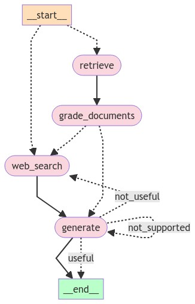

# Agentic RAG

## Description
Using LangGraph to build agentic workflow based on
- Corrective-RAG (CRAG) paper uses self-grading on retrieved documents and web-search fallback if documents are not relevant.
- Self-RAG paper adds self-grading on generations for hallucinations and for ability to answer the question.
- Adaptive RAG paper routes queries between different RAG approaches based on their complexity.


LangGraph built-in mermaid visualization

## Installation

To get started, follow these steps:

1. **Clone the repository**:
    ```sh
    git clone https://github.com/yourusername/advanced-rag.git
    cd advanced-rag
    ```

2. **Install dependencies**:
    [Poetry](https://python-poetry.org/) is recommended for dependency management.
    ```sh
    poetry install
    ```

3. **Set up environment variables**:
    Create a `.env` file in the root directory and add necessary environment variables.
    ```sh
    OPENAI_API_KEY 
    TAVILY_API_KEY
    LANGCHAIN_API_KEY
    LANGCHAIN_TRACING_V2
    LANGCHAIN_PROJECT
    ```

## Usage

To run the main application:

```sh
cd agentic_rag
poetry run python main.py
```
